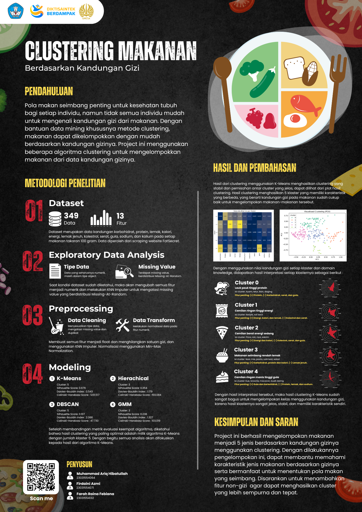
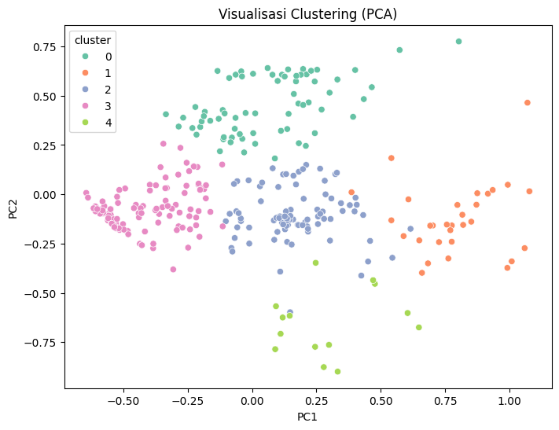
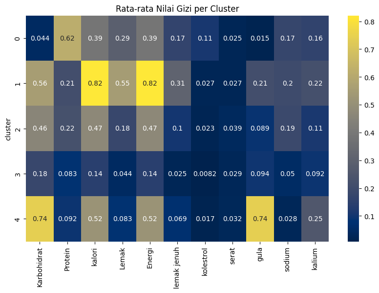

# Clustering Makanan Berdasarkan Kandungan Gizi
Project ini merupakan implementasi dari Data Mining yang dilakukan tahapan data collecting, data preprocessing dan processing, analisis hasil, dan mengambil insight dari data yang telah diproses. Project Data Mining ini menggunakan metode clustering untuk mengelompokkan makanan berdasarkan kandungan gizinya, dengan tujuan untuk mengetahui karakteristik setiap kelompok makanan dan menemukan pola dalam jenis-jenis makanan tersebut.

# Dataset
Dataset yang dipakai adalah data kandungan karbohidrat, protein, lemak, kalori, energi, lemak jenuh, kolestrol, serat, gula, sodium, dan kalium pada setiap makanan dalam takaran saji 100 gram. Data yang digunakan diperoleh dari hasil scraping website yang menyediakan informasi gizi seperti website FatSecret.

Untuk detail dataset bisa dilihat pada file [dataset](Dataset_Gizi.csv).

# Algoritma yang digunakan
1. K-Means, membagi data ke dalam k cluster berdasarkan kedekatan ke titik pusat tiap cluster.
2. Density-Based Spatial Clustering of Applications with Noise (DBSCAN), mencari area dengan kepadatan tinggi sebagai cluster, dan menganggap titik-titik noise sebagai outlier.
3. Hierarchical Clustering, mulai dari setiap titik sebagai cluster sendiri lalu gabungkan dua cluster terdekat secara bertahap hingga membentuk satu cluster besar.
4. Gaussian Mixture Model (GMM), mengasumsikan data berasal dari campuran beberapa distribusi Gaussian, dan menghitung probabilitas tiap titik berasal dari masing-masing cluster.

# Hasil Modeling
Dilakukan modeling menggunakan 4 algoritma yang hasilnya akan dievaluasi dan dibandingan untuk mencari algoritma dengan performa yang terbaik.
1. K-Means
   - Cluster: 5
   - Silhouette Score: 0.676
   - Davies-Bouldin Index : 0.543
   - Calinski-Harabasz Score : 1231.517

2. DBSCAN
   - Cluster: 5
   - Silhouette Score: 0.107
   - Davies-Bouldin Index : 2.066
   - Calinski-Harabasz Score : 47.730

3. Hierarchical Clustering
   - Cluster: 3
   - Silhouette Score: 0.354
   - Davies-Bouldin Index : 1.179
   - Calinski-Harabasz Score : 159.084

4. GMM
   - Cluster: 3
   - Silhouette Score: 0.238
   - Davies-Bouldin Index : 1.327
   - Calinski-Harabasz Score : 103.019

# Hasil Cluster
Setelah membandingkan hasil metrik evaluasi dari keempat algoritma, maka diputusakan untuk menggunakan algoritma K-Means dengan jumlah 5 cluster, dikarenakan hasilnya yang paling baik dan optimal secara statistik.

- Cluster 0 (Lauk pauk tinggi protein) 
Pada cluster ini diketahui bahwa kandungan nutrisi dengan nilai tertinggi yang ada pada setiap makanan adalah kandungan protein dengan nilai 0.62 dan nilai terendah ada pada kandungan gula yaitu 0.015. Jenis makanan pada cluster ini  merupakan makanan yang kaya protein namun rendah kandungan karbohidrat, gula, dan serat, biasanya jenis makanan dengan kandungan nutrisi ini adalah lauk pauk seperti ayam, telur, daging, tahu, dan tempe.

- Cluster 1 (Cemilan ringan tinggi energi) 
Pada cluster 1 kandungan nutrisi tertinggi ada pada kalori dan energi dengan nilai 0.82, didukung dengan kandungan karbohidrat dan lemak dengan nilai 0,56 dan 0,55. Dan kandungan terendah pada cluster ini adalah kolesterol dan serat dengan nilai 0.027. Makanan pada cluster ini isinya adalah cemilan ringan yang memiliki kandungan energi yang tinggi seperti keripik kentang dan jagung, donat, kue, wafer, kacang almond, bolu, dan popcorn. 

- Cluster 2 (Cemilan berat energi sedang) 
Pada cluster 2 kandungan nutrisi tertinggi ada pada karbohidrat, kalori, dan energi dengan nilai 0.46 dan 0.47, sedangkan rendah pada kolestrol, serat, dan gula. Makanan pada cluster ini isinya adalah cemilan berat tetapi memiliki proprosi yang cukup rata dikarenakan termasuk makanan olahan seperti roti, pizza, risol, eskrim. 

- Cluster 3 (Makanan seimbang rendah lemak) 
Pada cluster 3 kandungan nutrisi tergolong rata pada setiap aspek. Hal tersebut dikarenakan makanan dikelompok ini merupakan makanan yang seimbang dan merupakan makanan yang dikonsumsi untuk mencukupi kebutuhan gizi, seperti nasi, mie, pasta, oatmeal, dan salad.

- Cluster 4 (Cemilan ringan manis tinggi gula) 
Pada cluster 4 kandungan nutrisi tertinggi ada pada karbohidrat dan gula dengan nilai 0.74, dan kandungan terendah pada cluster ini adalah protein, lemak, dan sodium. Makanan pada cluster ini isinya adalah makanan ringan yang manis seperti buah-buahan kering, brownis, macaron, permen, dan kismis.

Untuk hasil lengkap cluster dan nama makanannya bisa dilihat [di sini](Hasil_Cluster.csv).

## Authors
Project ini dibuat oleh:
- Muhammad Ariq Hibatullah (23031554064)
- Firdaini Azmi (23031554071)
- Farah Raina Febiana (23031554132)
